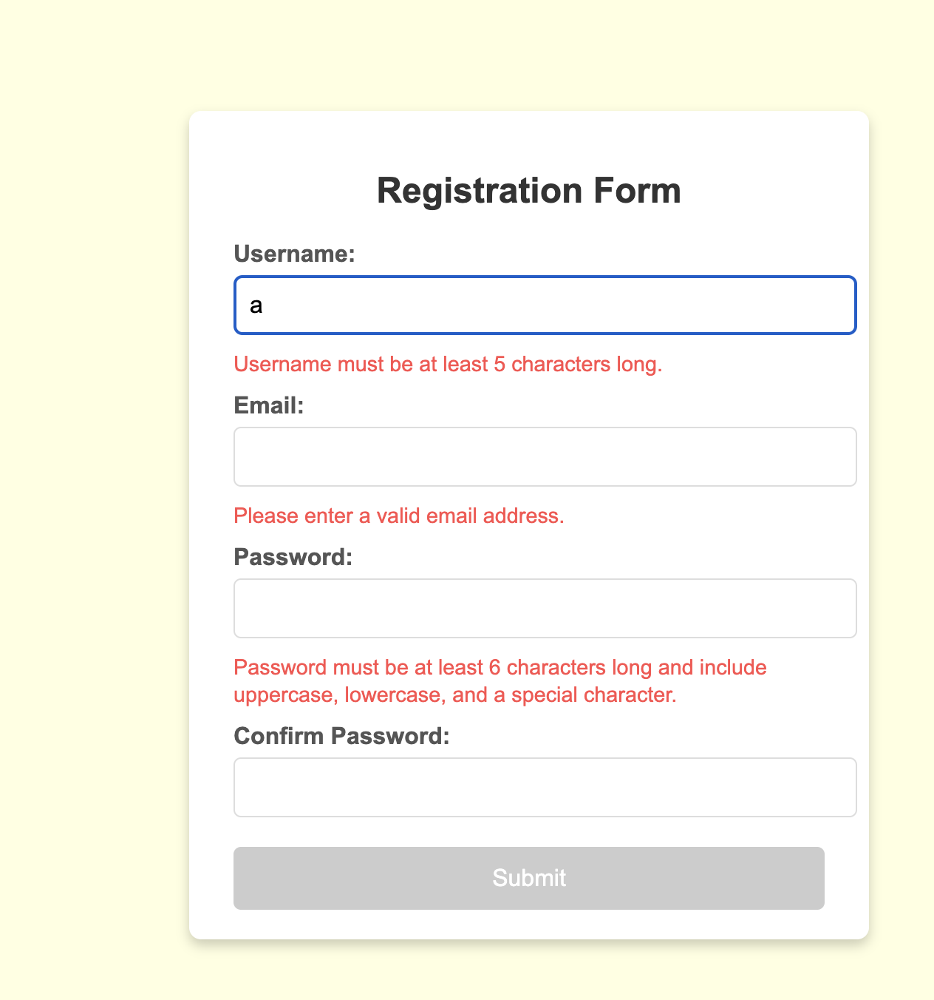
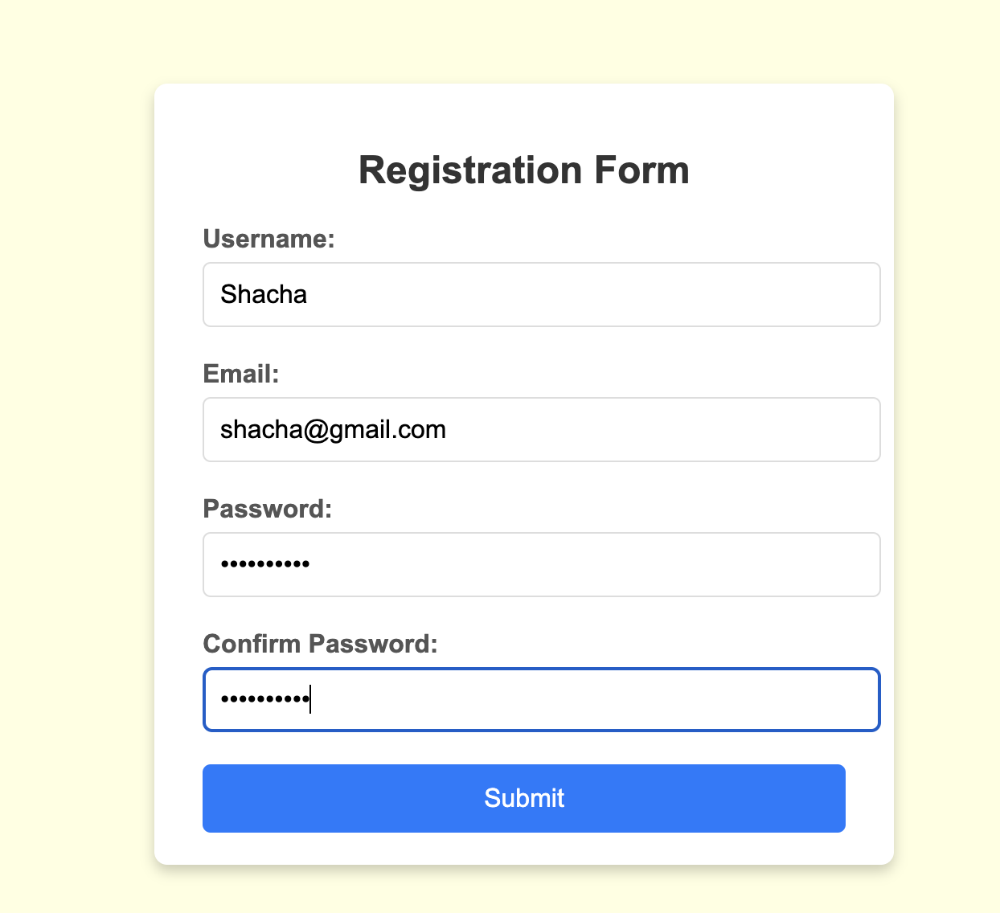

# Main Concepts Applied
In this project, I implemented a user registration form with frontend form validation using HTML, CSS, and JavaScript. Key concepts included:

1. HTML Structure for Forms: I structured the form with multiple input fields, each accompanied by labels and placeholders for error messages, and ensured accessibility by labeling each input field correctly.

2. CSS Styling for User Interface: I styled the form for a clean, centered look that improves readability, using elements like flexbox for alignment, and setting custom error and success message styles for visual clarity.

3. JavaScript for Form Validation: By applying JavaScript validation, I checked input values in real-time, providing users with immediate feedback for errors, such as invalid email formats or mismatched passwords.

# New Skills or Knowledge Acquired

1. Real-Time Validation with JavaScript: I learned how to validate input fields dynamically, updating feedback as the user types. This approach to validation improves user experience by making it clear what corrections are needed.

2. Dynamic Button Control: I gained a better understanding of JavaScript logic by enabling/disabling the submit button based on the current form status, enhancing the reliability of form submission.

3. Error Message Styling: Learning to style error messages helped me understand the importance of effective UI/UX design, especially how visual feedback can help guide users through form completion.

# Reflection
## What I Learned

* This exercise allowed me to deepen my understanding of client-side validation and event-driven programming. I learned how to enhance user interaction with JavaScript, refining my knowledge of conditionals and how to use them to display feedback effectively. This exercise demonstrated the importance of building responsive and accessible interfaces for a seamless user experience.

# Challenges Faced and Solutions

1. Challenge: Managing Error Messages Across Fields

* Solution: I tackled this by defining reusable .error and .valid CSS classes and attaching them to JavaScript validation functions. By applying and removing classes dynamically, I maintained a uniform display of error messages across all input fields.

### Screenshot

2. Challenge: Synchronizing Password and Confirm Password Fields

* Solution: To ensure the “Confirm Password” field matched the “Password” field, I implemented a custom validation function that checked for equivalency in real-time. This was challenging at first, but I refined my approach by adding an input event listener to both fields, providing users with immediate feedback.

### Screenshot

