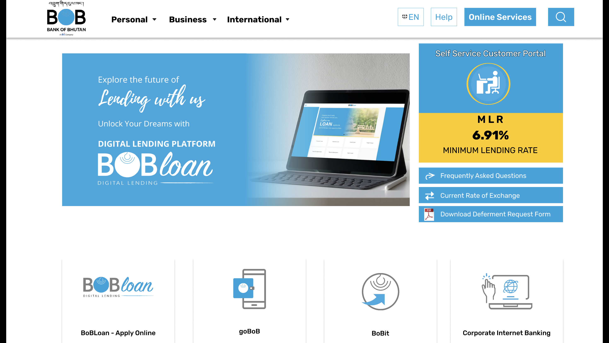
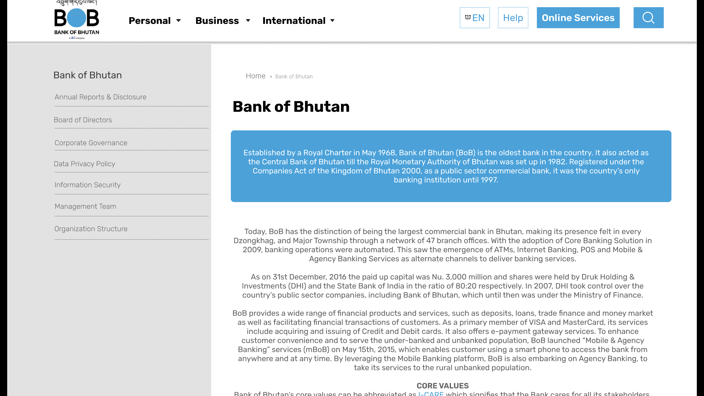
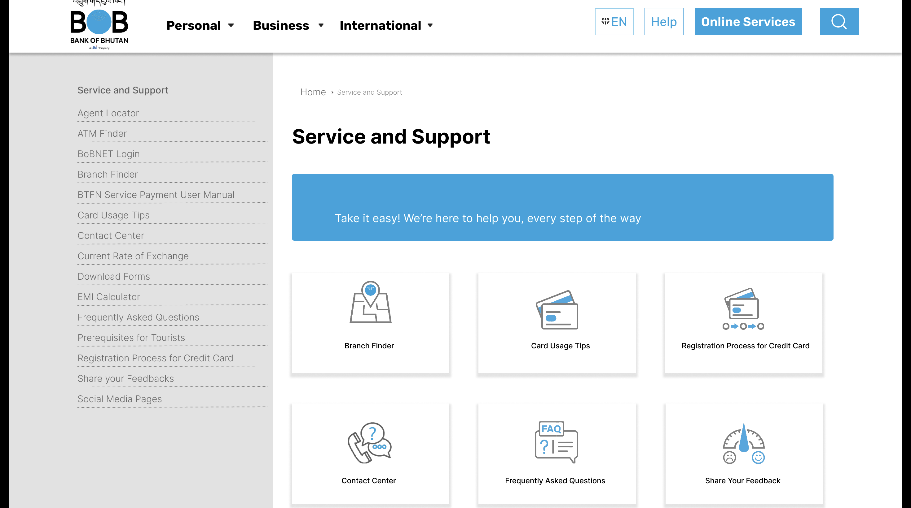
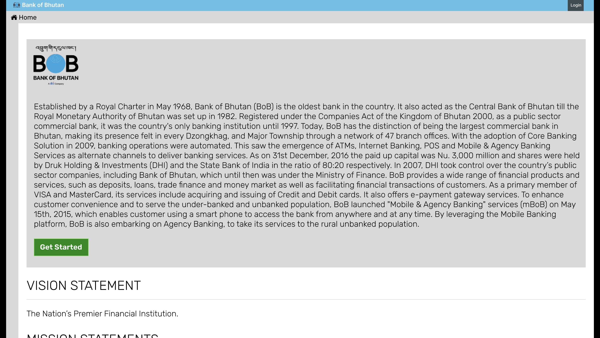
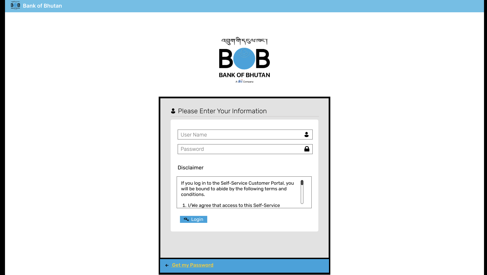

# Practical Assignment 1 - UI/UX Design with Figma

## Introduction
In this assignment, your goal is to create designs for five key pages of a specified digital
platform using Figma in groups. You'll apply design concepts, demonstrate tool proficiency,
showcase creativity in problem-solving, and present a well-organized design.

## Project Overview

You will design five pages of a website based on an assigned website genre using Figma.
This involves the following steps:
1. Familiarize yourself with the assigned website genre and research existing
websites in this category.
2. Identify five key pages that are crucial for the assigned genre (e.g., home page,
product listing, user profile, etc.).
3. Create a new Figma project and set up your artboards for the five pages.
4. Design the layout and structure of each page, considering user flow and
information architecture.
5. Apply appropriate color schemes, typography, and visual elements that align with
the genre's typical style and your creative vision.
6. Use Figma's prototyping features to create basic interactions between pages.
7. Apply responsive design principles to ensure the design works well on different
screen sizes.
8. Review and refine your designs, paying attention to details like spacing, alignment,
and visual hierarchy.
9. Prepare your Figma file for submission, organizing layers and frames neatly.

## Figma Link
https://www.figma.com/design/OEOagIlfsRgucluULNbJfT/Group-6?node-id=0-1&t=thh7YFTpS8xYDwhE-1

## Screenshots

