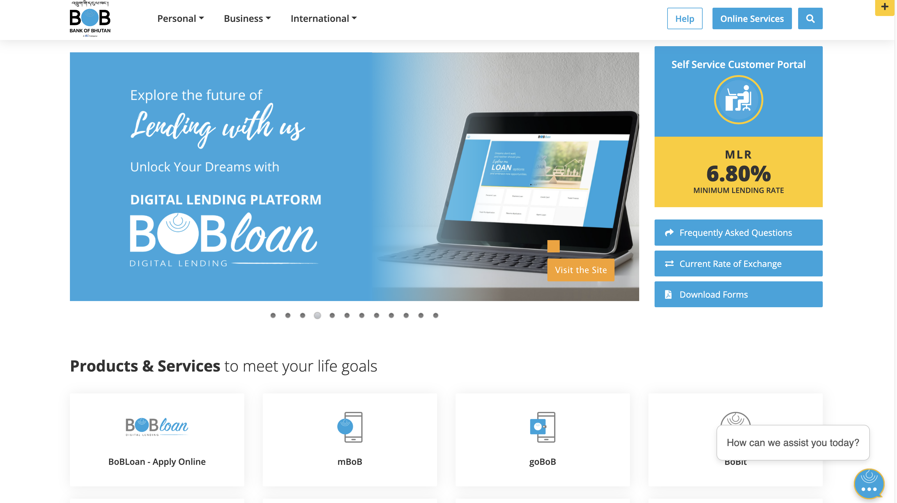
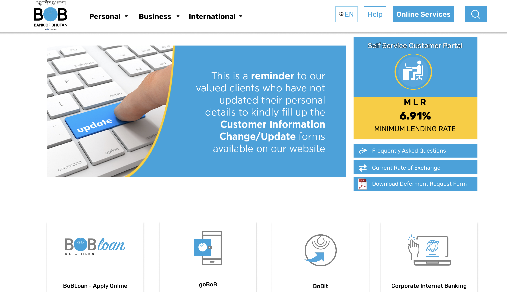
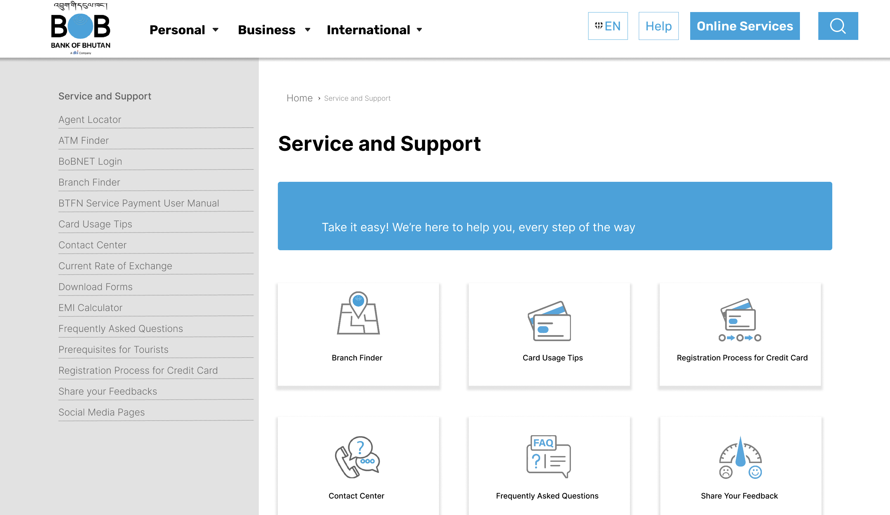

# Main Concepts Applied

In this project, I focused on several core design principles:

1. Visual Consistency: Ensured that the replicated design maintained the original’s color palette, typography, and layout to create a cohesive look.

2. Use of Components: Utilized Figma’s component features to create reusable design elements, streamlining the replication process and maintaining consistency.

3. Grid and Layout Systems: Applied grid systems to accurately align elements, replicating the original design’s structure.

# New Skills or Knowledge Acquired

1. Figma Navigation and Tools: Enhanced my skills in using Figma’s advanced tools, including constraints and auto-layout, for effective design replication.

2. Attention to Detail: Developed a keen eye for detail, learning to spot subtle design nuances such as spacing, alignment, and color matching.

3. Critical Analysis of Design: Gained a deeper understanding of design decisions by analyzing the original website’s user experience and visual hierarchy.

# Reflection
## What I Learned

1. Importance of Prototyping: Realized the value of prototyping in understanding user interactions, which informed my design decisions during the replication process.

2. Iterative Improvement: Emphasized the importance of feedback in the design process, allowing for refinements and enhancements to my work.

# Challenges and Solutions

1. Achieving Accurate Color Matching:
* Problem: Ensuring color accuracy to match the original design was difficult (screenshot of color picker can be added).
* Solution: Used color sampling tools and Figma’s color styles to replicate the color palette precisely.

2. Maintaining Layout Integrity
* Problem: Aligning elements perfectly to reflect the original layout was challenging due to varying text lengths and image sizes.
* Solution: Employed Figma’s alignment tools and guidelines to maintain structure and achieve accurate placements.

## Screenshots

