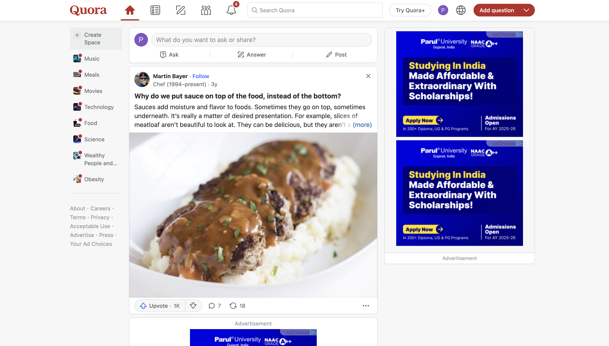
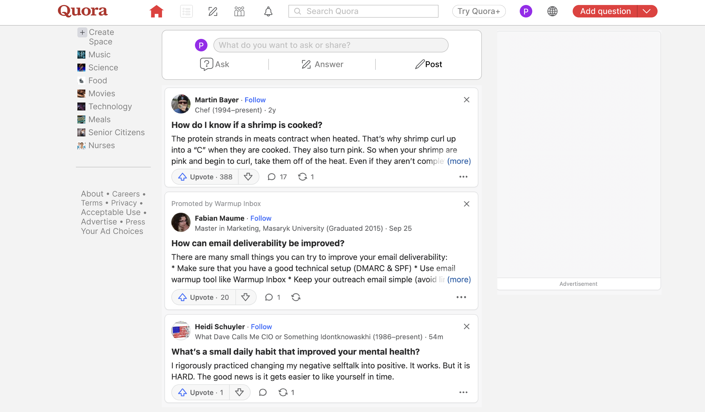
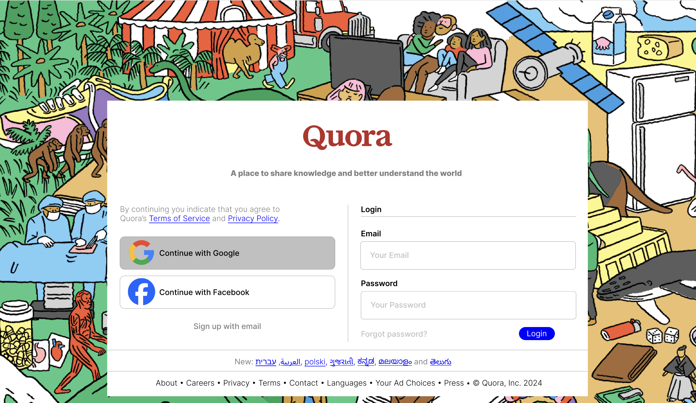

# Main Concepts Applied

1. Component-Based Design: I created reusable components that encapsulated both visual elements and their behavior. This approach allowed me to maintain consistency throughout the design while improving efficiency in the design process.

2. Design Systems: I leveraged Figma’s design system capabilities to ensure that all components adhered to a unified style guide. This included defining typography, color palettes, spacing, and UI elements that align with Quora’s aesthetic.

3. User-Centered Design: I applied user-centered design principles to understand the needs and behaviors of Quora’s users. This involved analyzing user interactions and prioritizing features that enhance usability and satisfaction.

# New Skills and Knowledge Acquired
Through this assignment, I gained valuable skills and knowledge, including:

1. Advanced Figma Techniques: I became proficient in using Figma’s component properties and variants, which significantly streamlined the design process and allowed for quicker iterations.

2. User Interface (UI) Design: I deepened my understanding of UI design principles, focusing on user experience and the importance of creating intuitive navigation and interactions.

# Reflection
## What I Learned

1. Importance of Attention to Detail: Replicating a platform like Quora highlighted the need for precision in design elements to achieve a professional look.

2. User Experience (UX) Focus: I gained a deeper understanding of how users interact with components, which improved my ability to create intuitive and user-friendly designs.

3. Component Design Mastery: I learned to effectively create and manage reusable components in Figma, enhancing design consistency and efficiency.

4. Iterative Design Process: Through multiple iterations and testing, I saw the value of continuously refining designs to enhance quality and functionality.

# Challenges Faced and Solutions

1. Cohesion of Components
* Issue: Initially, some components did not align well with Quora's established visual language, leading to inconsistencies in the design.
* Solution: I conducted thorough research on Quora’s design patterns and styles. By analyzing their interface closely, I was able to iterate on my components and ensure they matched the original design more accurately.

2. Understanding User Interaction

* Issue: At times, it was difficult to fully grasp how users interacted with certain features on Quora, making it challenging to replicate the functionality accurately.
* Solution: I engaged in user testing with peers, asking them to interact with my design. Their feedback provided insights into usability and helped identify areas for improvement.

# Screenshots

