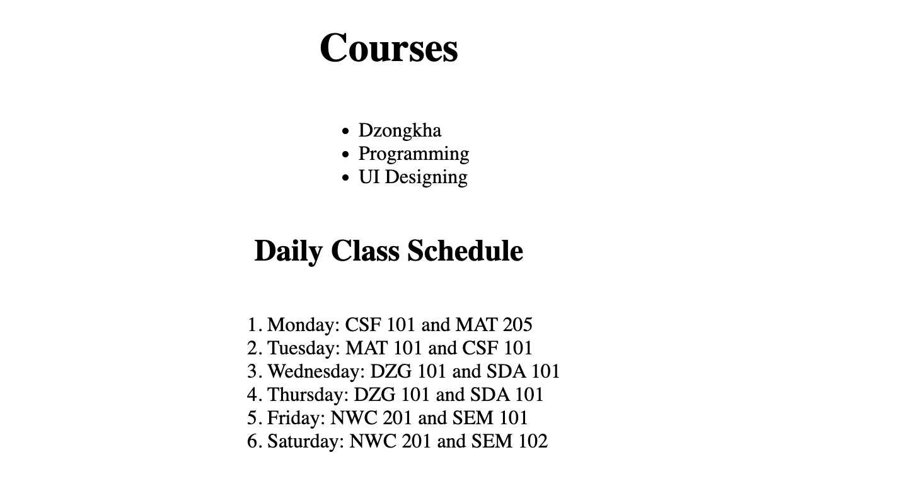

# Main Concepts Applied

In this HTML project, I organized information using a variety of list types and heading levels. Key concepts applied include:

1. HTML Structure and Semantic Tags: Implemented headings (h1, h2, h3, h4) to create a clear hierarchy and to improve readability and accessibility for users.

2. Lists: Utilized ordered (ol) and unordered lists (ul) for different types of content, including nested lists to create sub-categories within main items.

3. CSS Linkage: Linked to an external stylesheet (list.css) to style the webpage consistently across multiple pages, following best practices by separating style and structure.

# Skills and Knowledge Acquired
I improved my understanding of:

1. HTML Lists: Gained experience in creating and nesting lists, especially in using ordered lists within unordered lists to structure complex content.

2. Centering and Layout: Learned alternative, modern ways to center content using CSS, moving away from the deprecated (center) tag.

3. CSS Integration: Enhanced my knowledge of linking and applying external CSS files to manage design and structure independently.

# Reflection
## What I Learned

This project taught me the importance of using proper HTML structure and semantic tags for accessibility and clarity. I also learned efficient ways to create complex lists, which can be very useful for organizing content on the web.

# Challenges and Solutions

1. Centering Headings:
* Challenge: I initially centered headings using the outdated (center) tag within HTML. After researching, I learned that text-align: center in CSS is a more effective and modern approach.
* Solution: I moved the center alignment to the CSS file, making the HTML cleaner and following best practices.

2. Nested List Formatting:
* Challenge: At first, I struggled with formatting nested lists correctly for the "Study Goals" section, where each topic required sub-points.
* Solution: After referring to HTML list documentation, I understood that placing (ol) elements within (li) tags creates the desired structure. This allowed me to build well-organized subcategories under each study goal.

## Screenshots

