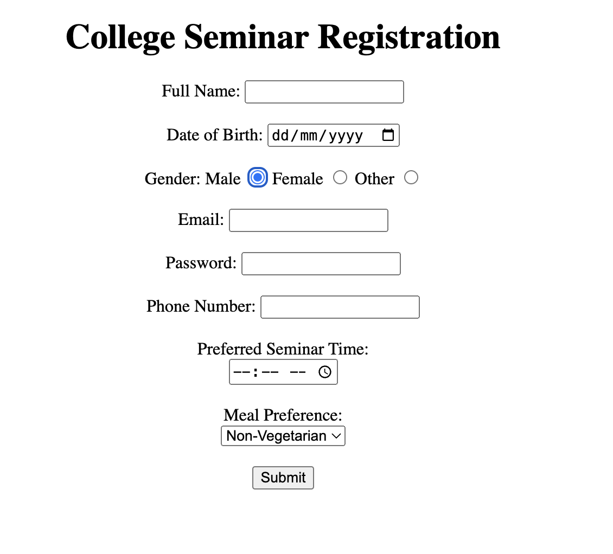
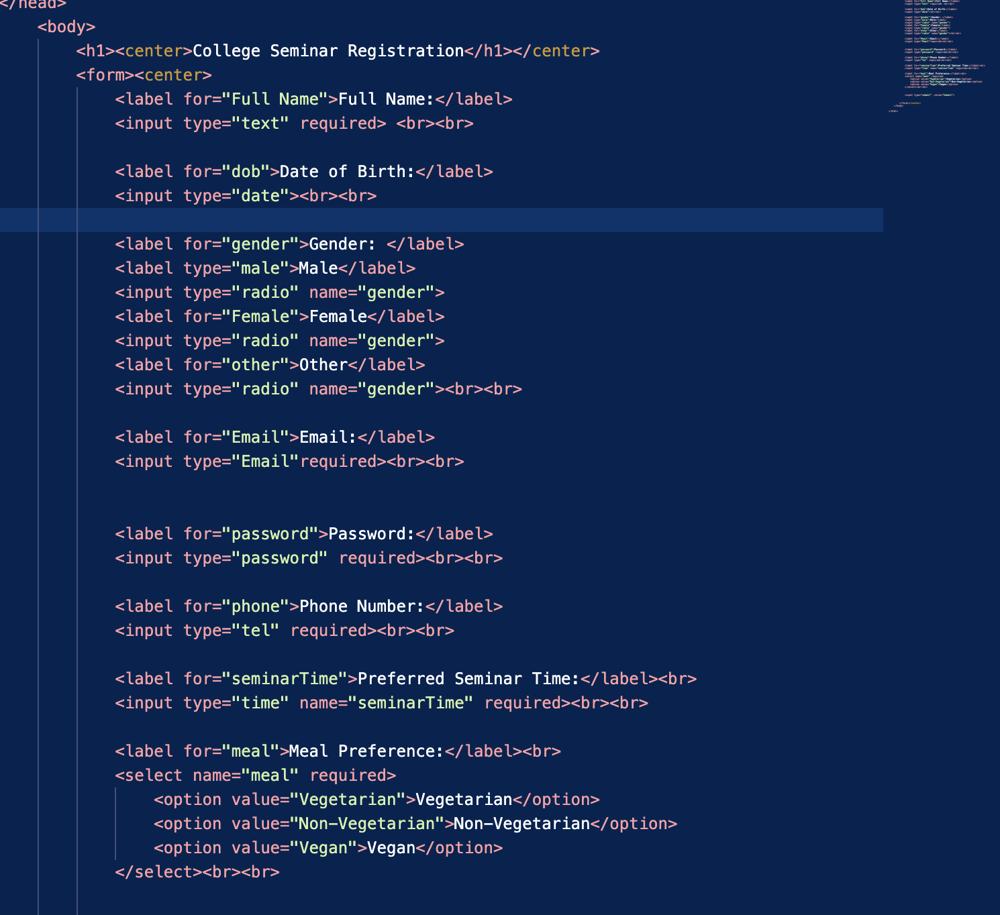

# Main Concepts Applied

#### 1. HTML Form Structure
* Used (form), (label), and (input) tags to create a structured and accessible form.
* Semantic HTML was used to improve user experience and accessibility.

#### 2. Input Fields and Validation
* Input types: Included fields for text (type="text"), email (type="email"), password (type="password"), radio buttons for gender, date (type="date"), time (type="time"), and phone number (type="tel").
* Required Attribute: Used required on mandatory fields to ensure complete submissions.

#### 3. Dropdown Menu

* Added a meal preference selection with (select) and (option) tags, allowing users to choose between vegetarian, non-vegetarian, and vegan options.

#### 4. Center Alignment

* Employed (center) tags for form alignment. Though it provided basic centering, CSS could improve control and flexibility for consistent styling.

# New Skills or Knowledge Acquired

1. Validation Techniques: Learned to apply the required attribute, improving data integrity by preventing incomplete submissions.

2. Input Variety: Gained experience with different input types like type="password" for secure input and type="tel" for phone numbers.

3. Accessibility: Enhanced understanding of accessibility by using (label) tags linked with for attributes, aiding screen readers and usability.

# Reflection
## What I Learned

1. HTML Form Elements: Practiced creating accessible and user-friendly forms, learning to organize various input types for a clear, functional structure.

2. Labeling and User Experience: Recognized the importance of descriptive labels for usability, ensuring each field is clearly explained to the user.

## Challenges and Solutions

1. Alignment Issues

* Challenge: Aligning the form with (center) was challenging as it offered limited styling control. Switching to CSS for alignment and layout will provide more flexibility and consistency.
* Solution: To overcome alignment challenges, I reviewed CSS alternatives for centering elements.

2. Data Validation

* Challenge: Managing the type="tel" field for phone numbers was initially confusing as it doesn’t enforce a specific format by default. This highlighted the need for additional validation or formatting for user inputs.
* Solution: For data validation issues, I referred to HTML documentation, learning about different input types and the pattern attribute for enforcing formats.

## Screenshots

