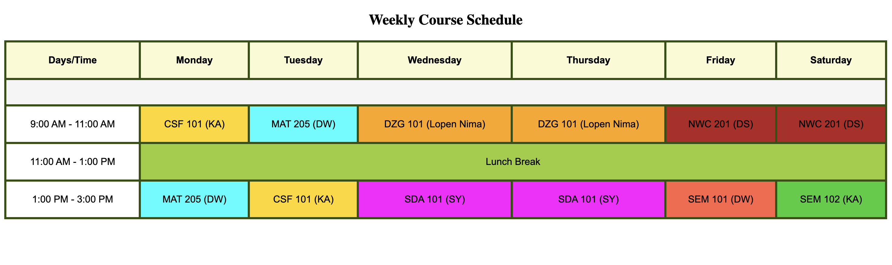
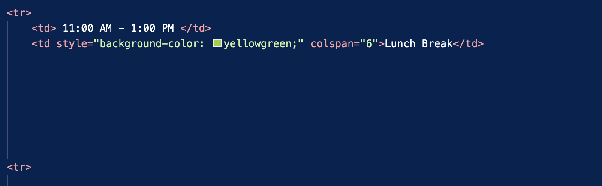

# Main Concepts Applied

1. HTML Structure: Used fundamental HTML tags like (table), (tr), (td), and (th) to create an organized layout for the weekly course schedule.

2. CSS Styling: Applied CSS directly within the HTML to style the table. This included setting the font family, adding borders, aligning text to the center, and adding padding for consistent cell spacing.

3. Centering Elements: Centered the heading and table on the page for visual appeal and better alignment.

4. Color Coding: Added specific background colors for each course and lunch break to make the schedule easy to interpret at a glance.

# New Skills or Knowledge Acquired

1. Cell-Specific Background Colors: Learned how to apply distinct background colors to individual cells, improving the table’s visual structure and making it more user-friendly.

2. Spanning Cells with colspan: Gained an understanding of using the colspan attribute to merge cells across multiple columns, specifically to span the "Lunch Break" across all days, which created a cleaner layout.

3. Inline CSS Application: Practiced embedding CSS within HTML, which enhanced my understanding of applying inline styles to HTML elements.

# Reflection
## What I Learned

1. Enhanced HTML and CSS Proficiency: This exercise reinforced my understanding of HTML table structures and the organization of CSS styles for creating clear, structured layouts.

2. Improved Table Layout Skills: Gained experience in aligning table text, managing padding, and applying consistent styles to improve readability.

3. Importance of Visual Organization: Recognized how color coding and structure can help users quickly interpret information, an important concept for user experience.

# Challenges and Solutions

1. Consistent Cell Sizing
* Issue: Achieving uniform cell sizes across different days and subjects required consistent padding and alignment.
* Solution: Used text-align: center and uniform padding in CSS, which aligned all cells and provided a consistent appearance.

2. Spanning Lunch Break Across Row
* Issue: Spanning the lunch break cell across the row without disrupting the table layout was initially tricky.
* Solution: Implemented the colspan="6" attribute on the lunch break cell to stretch it across all columns, achieving the intended layout and alignment.

## Screenshots

