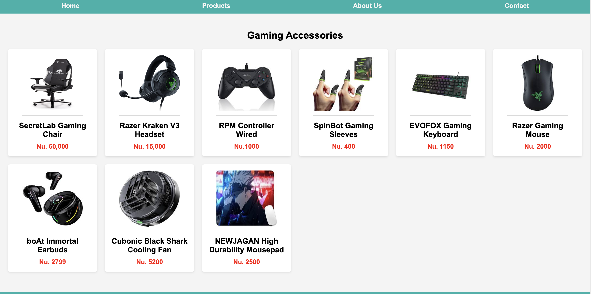

# Main Concepts Applied

1. HTML Structure: Used HTML5 semantic elements such as header, main, and footer to improve readability and accessibility. This helps organize the website's structure and ensures that screen readers and search engines can better interpret the content.

2. Navigation Bar: Created a navigation bar for easy access to different pages like Home, Products, About Us, and Contact. This improves user experience by enabling quick navigation across the website.

3. Grid Layout for Products: Designed a product grid using CSS to display items in an organized, visually appealing way. Each product includes an image, title, and price, making the layout look like an e-commerce store.

4. Icons: Integrated social media icons using Ionicons, a library providing high-quality icons, to enhance the footer section.

# New Skills or Knowledge Acquired

1. Image Embedding: Learned how to embed and format product images within a grid structure. This skill was essential in creating a consistent and appealing product display.

2. Ionicons Library: Gained experience using the Ionicons library, understanding how to integrate external icon libraries to enhance the site’s look.

3. Semantic HTML: Developed a deeper understanding of semantic HTML elements, which improve page structure and accessibility.

# Reflection
## What I Learned

* This exercise helped reinforce the importance of clean, organized HTML structure and CSS styling for user-friendly layouts. Understanding how to use semantic elements and icon libraries added depth to the project.
* I gained insight into the process of creating a basic e-commerce layout by working with grid structures and embedding product details with images.

## Challenges and Solutions

1. Challenge: Initially, aligning images and text in the product grid was difficult, as they did not fit uniformly, causing uneven spacing and misalignment.
* Solution: Adjusted image sizes and used CSS flexbox for centering and aligning elements within each product box, which provided a clean, consistent look across all products.

2. Challenge: Encountered issues displaying Ionicons initially, as they required a separate JavaScript script link for proper functionality.
* Solution: Researched the Ionicons library documentation and successfully implemented the script, allowing the icons to render correctly on the page.

## Screenshots

