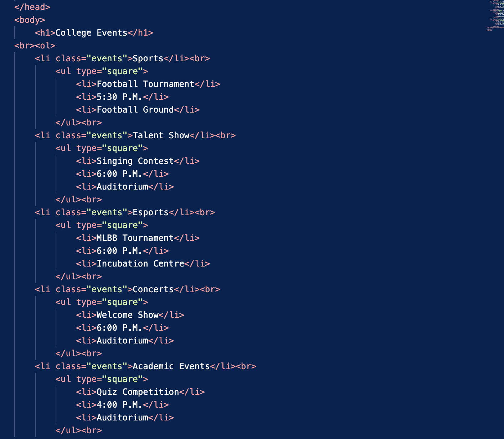
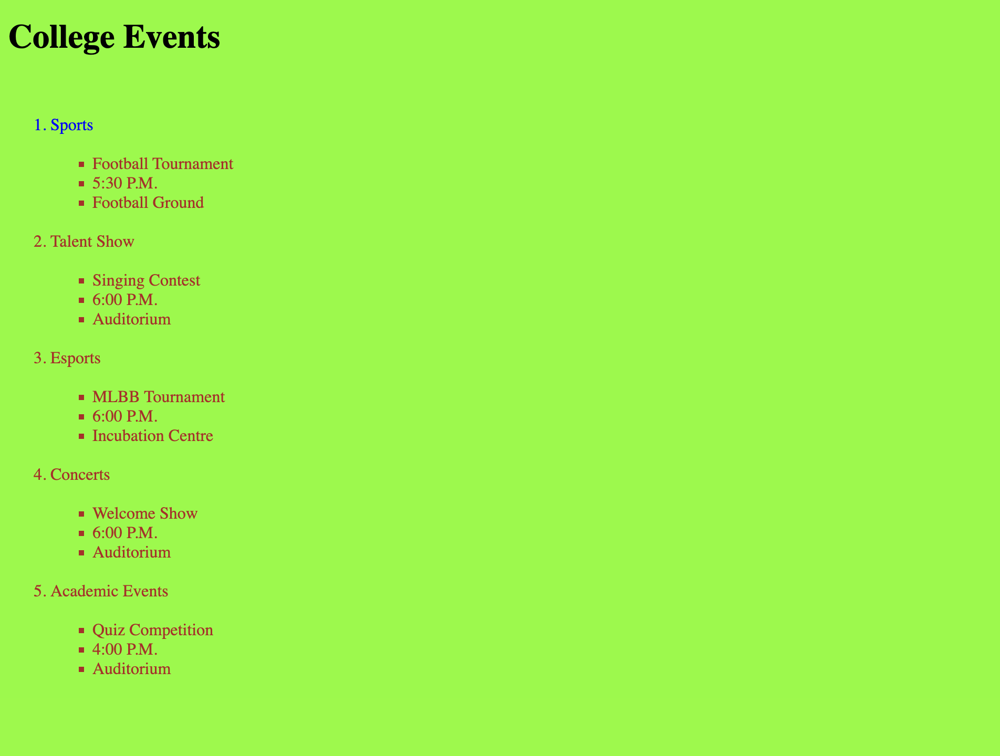

# Main Concepts Applied

1. HTML Structure: Utilized HTML elements to create a well-structured document, including headings, lists, and semantic tags.

2. Nested Lists: Implemented nested lists to categorize college events, enhancing the organization of information and improving readability.

3. CSS Integration: Linked an external CSS file (styles.css) to manage styles for various elements, enabling separation of content and presentation.

# New Skills or Knowledge Acquired

1. List Styling: Gained experience in customizing list types in HTML (e.g., using type="square" for unordered lists) to improve visual appeal.

2. Semantic HTML: Developed a better understanding of using semantic HTML elements, such as (ol) for ordered lists and (ul) for unordered lists, which enhance accessibility and Search Engine Optimizations(SEO).

## Reflection
# What I Learned

1. Organization of Content: Learned how important it is to organize content logically, making it easier for users to navigate and find information.

2. Effective Use of Lists: Realized the benefits of using nested lists to present related information, enhancing clarity and user experience.

3. CSS Linking: Understood the process of linking CSS files to HTML documents, which allows for easier maintenance and styling.

## Challenges and Solutions

1. Challenge: While coding, I encountered validation errors related to improper use of HTML tags, particularly the incorrect nesting of (br) tags within lists.
* Solution: I removed unnecessary (br) tags and ensured that list items were properly structured, enhancing the overall validity of the HTML document.

2. Challenge: Initially struggled with the proper indentation and alignment of nested lists, leading to a cluttered appearance.
* Solution: Implementing CSS styles improved the spacing and alignment of list items.

## Screenshots

