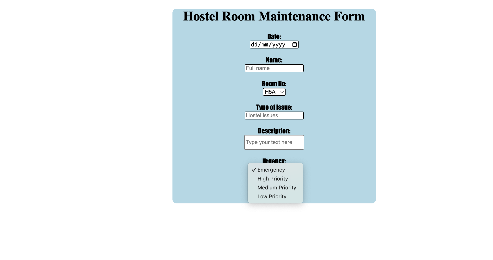
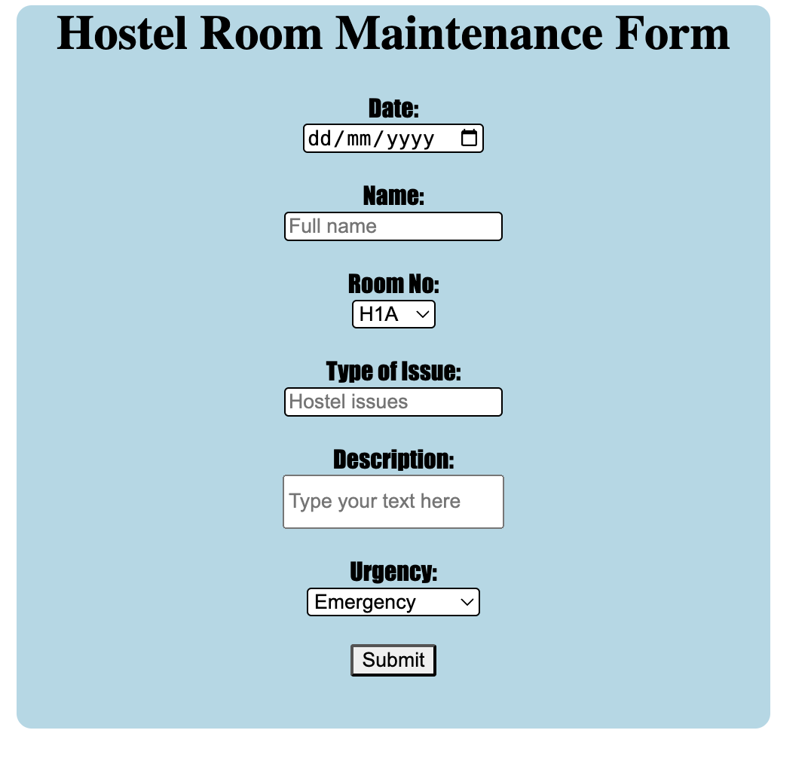
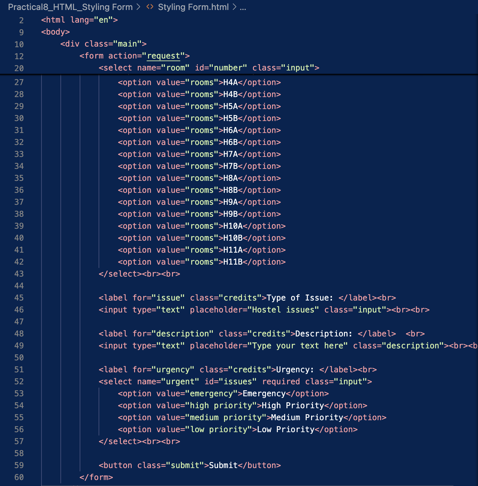

# Main Concepts Applied
1. HTML Structure:
* Utilized semantic HTML tags to create a well-structured form for hostel room maintenance requests.
* Employed form elements such as (input), (select), and (button) to facilitate user input.

2. Form Validation:
* Implemented required attributes in input fields to ensure that necessary information is captured before submission, improving user experience and data integrity.

3. Styling with CSS:
* Integrated an external CSS file (styling.css) to manage the visual presentation of the form, creating a user-friendly interface.

# New Skills or Knowledge Acquired

1. CSS Flexibility:
* Gained experience in linking and utilizing an external CSS stylesheet to maintain design consistency across web pages.

2. Form Handling:

* Learned the importance of structuring forms for both functionality and aesthetics, which is crucial for enhancing user experience in web applications.

# Reflection
## What I Learned

1. Importance of User-Centric Design:
* Recognized that designing forms requires careful consideration of user needs, ensuring that all necessary information is collected efficiently without overwhelming the user.

2. Best Practices in Web Development:
* Familiarized myself with best practices for HTML form design, such as using appropriate input types (e.g., date, text) and providing clear labels.

## Challenges and Solutions

1. Input Validation:
* Challenge: Initially, I faced difficulties ensuring that the input fields provided appropriate validation feedback.
* Solution: I researched HTML5 validation attributes and incorporated them to guide users on required fields, enhancing form reliability.

2. Form Layout and Aesthetics:
* Challenge: Achieving a visually appealing layout that guides users through the form was challenging. The initial design felt cluttered and made it difficult for users to focus on each section.
* Solution: I revised the layout by adding clear spacing between form elements and utilizing consistent font sizes. Additionally, I organized the sections logically and implemented styling changes in my CSS to create a more intuitive flow, making the form easier to navigate.

3. Placeholder Text Clarity:
* Challenge: The placeholder text in the input fields was sometimes unclear, which led to confusion about what information was expected from users.
* Solution: I updated the placeholder text to be more descriptive and informative, ensuring it clearly indicated the required input. This change helped users understand what to enter in each field, reducing errors during form submission.

## Screenshots

