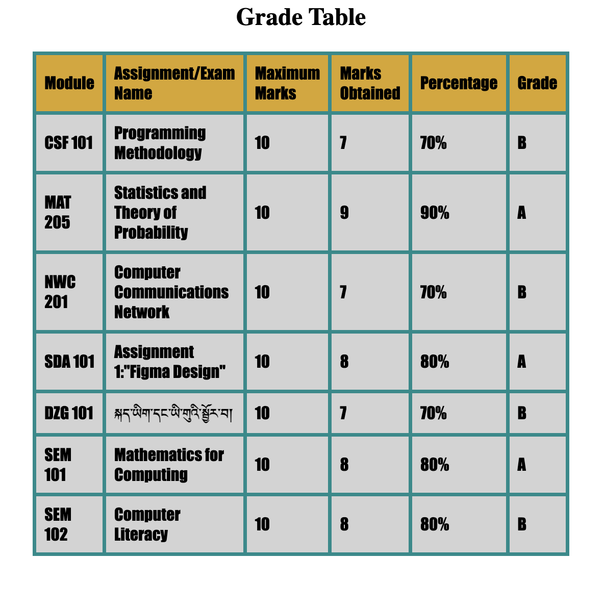
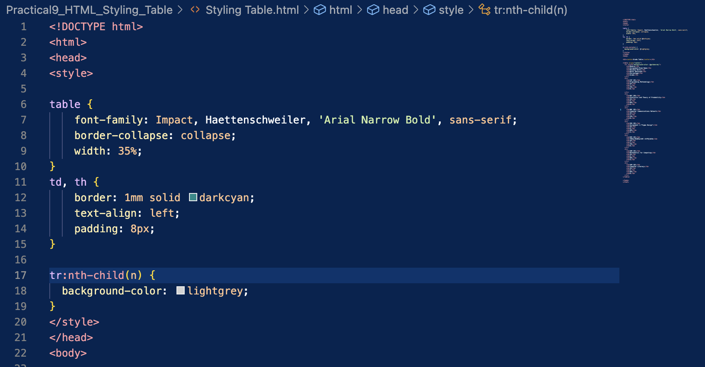

# Main Concepts Applied:

1. HTML Structure: Implemented the basic structure of an HTML document, including the (head) and (body) sections. Utilized (table), (tr), (th), and (td) elements to create a structured grade table.

2. CSS Styling: Applied CSS for styling the table. This included defining styles for fonts, borders, padding, and background colors to enhance the visual presentation. Used properties like border-collapse, text-align, and padding to ensure the table is user-friendly.
3. Responsive Design: Used percentage-based widths for the table, ensuring it adjusts based on screen size for better accessibility.

# New Skills or Knowledge Acquired:

1. Gained proficiency in using CSS properties effectively to style HTML elements, which enhanced my understanding of web design.
2. Learned how to incorporate specific font families and color schemes to align with design aesthetics.
3. Improved my ability to create structured data presentations using HTML tables, making it easier to convey information.

# Reflection
## What I Learned:

1. The importance of clear presentation: A well-structured table makes data easier to read and understand. Effective use of color and layout can greatly enhance user experience.

2. How to use CSS to improve the aesthetic appeal of web pages. The use of properties like background-color and border not only made the table visually appealing but also highlighted important data.

3. Understanding how to balance functionality and design; a visually pleasing design can complement the data presented without overshadowing it.

## Challenges and Solutions

1. Challenge: Ensuring the table remained visually appealing while maintaining readability.
* Solution: I experimented with different background colors and fonts, ensuring contrast between text and background was adequate.

2. Challenge: Managing consistent styling across different table cells, especially with varying lengths of text.
* Solution: I standardized the padding and alignment in my CSS, which helped create a uniform look, making the table more organized.
