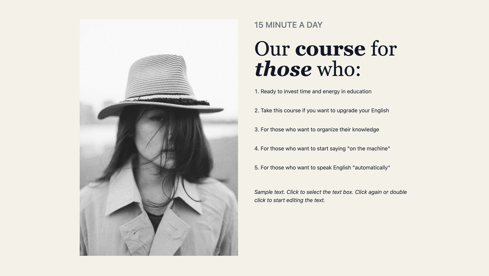

# Main Concepts Applied
* Throughout this assignment, I focused on building a responsive web design using Tailwind CSS, a utility-first CSS framework. I applied its responsive classes to ensure the layout adapts smoothly across various screen sizes. Instead of writing custom CSS for each element, I used Tailwind's utility classes directly in the HTML, which sped up the development process significantly.
* In addition, I relied on flexbox and CSS grid to create flexible layouts. These tools allowed me to structure the content intuitively, ensuring everything aligns properly whether viewed on mobile or desktop. This assignment also gave me the opportunity to apply semantic HTML for better accessibility and SEO(search engine optimization) — ensuring that the page is both functional and well-structured.

# New Skills or Knowledge Acquired
* A key skill I developed was working with Tailwind CSS. I quickly realized how efficient it can be for styling elements and creating responsive designs. Tailwind forced me to think more in terms of utility classes rather than traditional CSS, which was a shift but ultimately a huge time-saver.

# Reflection
# What I Learned
* Through this assignment, I gained deeper insight into the advantages of using Tailwind CSS for styling. It streamlined my development process by allowing me to apply pre-defined utility classes instead of writing extensive CSS rules. This experience helped me appreciate the efficiency of using utility-first frameworks for fast prototyping and development.

# Challenges Faced and How I Overcame Them
* One challenge I faced was getting comfortable with Tailwind’s vast set of utility classes. At first, I found it a bit overwhelming because there were so many options, and I wasn’t sure which classes to apply. To overcome this, I spent time with the documentation and tried out different combinations to see what worked best. It took a bit of trial and error, but once I got the hang of it, things started to fall into place.
* Another challenge was selecting the right color of the website footer. I chose the one color that was the closest to the original color, since the exact color which appeared to be brown didn't work when I wrote the code.

# Screenshots of Challenges:

